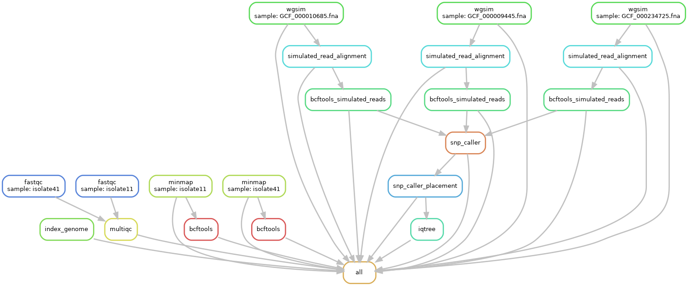

# BCG_vaccine_analysis
This workflow constructs a phylogeny tree using the reference genome strians. Here are the steps it performs to create a phylogeny tree.
Step1: Align the fastq files to reference genome
Step2: Site calling on the aligned files
Step3: Simulated read creation from reference strains
Step4: Align reference strains and site calling
Step5: Snp_caller
Step6: Snp_caller_placement
Step7: Tree construction

## Dependencies
The package requires “conda” to be installed and add the following channels 
```bash
 conda config --add channels defaults
 conda config --add channels bioconda
 conda config --add channels conda-forge
```

Dependencies can be installed by running environment.yml
```bash
conda env create --file environment.yml
conda activate BCG_analysis
```
<p align="center">

</p>

configure the config.yml before running the workflow. 
### Execution
```bash
snakemake --use-conda --cores 10
```
